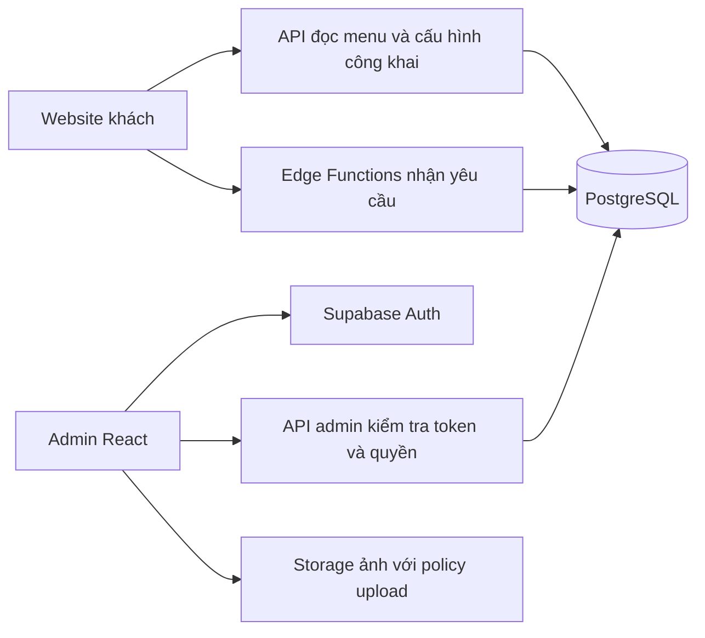

# Tiger 345: review hệ thống và kế hoạch triển khai

> BẢN CŨ — chỉ giữ làm lịch sử review. Bộ kế hoạch hiện hành và task coding nằm tại
> [tiger-345/README.md](tiger-345/README.md). Không triển khai giả định guest-only hoặc
> owner/manager/staff trong bản cũ; scope mới có customer optional và một quyền Admin.

Ngày review: 2026-09-19. Trạng thái: đề xuất, chưa triển khai backend/database/admin.
Phạm vi: mã nguồn local hiện tại, bao gồm các thay đổi chưa commit của người dùng.
Không xác minh deployment thực tế, cấu hình bảo vệ nhánh hay dịch vụ ngoài repo.

## 1. Kết luận và bằng chứng

Hiện tại là SPA demo giao diện nhà hàng, chưa phải hệ thống nhận đơn/đặt bàn.
React + TypeScript + Vite phù hợp với quy mô này; không có lý do phải viết lại toàn bộ.
Các trang đã được tách theo route, dữ liệu món có kiểu rõ ràng, giỏ dùng Context,
thông tin liên hệ có `SITE`, và CI có lint/typecheck/build. Đây là nền có thể giữ lại.

| Mức độ | Phát hiện | Bằng chứng và tác động |
|---|---|---|
| P1 nếu dùng với khách thật | Đặt món báo thành công nhưng không lưu/gửi đơn | `src/components/CartDrawer.tsx:67`: chỉ đổi state; dòng 139 khẳng định bếp đã nhận và đang nấu. Nhà hàng không nhận được đơn. |
| P1 nếu dùng với khách thật | Đặt bàn sinh mã ở trình duyệt, không có bản ghi hoặc kiểm tra chỗ | `src/pages/ReservationPage.tsx:36`: dùng Math.random rồi setIsSubmitted. Mã không tra cứu được, không bảo đảm duy nhất. |
| P1 trước khi vận hành | Chưa có nơi tiếp nhận và quản lý dữ liệu | `src/App.tsx:45` chỉ có 4 route khách; package/source không có backend, auth, database migration hay API client. |
| P2 | Ngày/điện thoại đặt bàn kiểm tra chưa đủ | `src/pages/ReservationPage.tsx:22,44,48`: ngày mặc định dùng UTC, điện thoại chỉ kiểm tra độ dài, ngày chỉ cần không rỗng. Có thể nhận ngày quá khứ; trước 07:00 ở Việt Nam ngày mặc định là hôm trước. |
| P2 | Giỏ mất khi reload | `src/store/CartProvider.tsx:7`: state trong bộ nhớ; chưa lưu nháp. |
| P2 | Giá và chính sách giao hàng nằm trong UI | `src/components/CartDrawer.tsx:62`: ngưỡng 300.000, phí 25.000; dòng 182 nói freeship 5km nhưng không có xác minh vùng giao. Khi có backend phải tính lại phía server. |
| P2 | Nội dung tư vấn không khớp thực đơn | `src/components/ContactHub.tsx:73,322`: FAQ/từ khóa hardcode; khoảng giá 95.000–385.000 trong khi dữ liệu có 55.000–890.000. |
| P2 | Chưa có test nghiệp vụ tự động | `package.json:6` và `.github/workflows/ci.yml`: chỉ lint/typecheck/build, chưa kiểm tra hành vi đặt món/bàn. |
| P3 | Còn các phiên bản component không được sử dụng | `MenuSection`, `ReservationSection`, `LocationSection` không có import sử dụng trong source hiện tại; dễ sửa nhầm bản khi nối API. |

P1 ở đây là rủi ro khi mở cho khách thật; mock là chấp nhận được nếu demo được ghi rõ.
Chưa có backend nên không kết luận đang tồn tại lỗ hổng phân quyền hoặc rò rỉ database.

## 2. Phạm vi sản phẩm đề xuất

Giả định để lập kế hoạch: một nhà hàng, khách không cần tài khoản, COD,
nhân viên xác nhận đơn và đặt bàn thủ công. Đây là giả định, không phải yêu cầu đã chốt.

MVP vận hành gồm:

- Khách xem thực đơn đang bán, gửi đơn giao hàng, gửi yêu cầu đặt bàn và nhận mã tiếp nhận.
- Nhân viên xem yêu cầu mới, xác nhận/từ chối, cập nhật trạng thái và ghi chú nội bộ.
- Quản lý sửa món/giá/trạng thái bán, giờ hoạt động, khu vực ngồi và chính sách giao hàng.
- Chủ quán quản lý tài khoản nhân viên, xem lịch sử thao tác và báo cáo cơ bản.

Chưa làm trong MVP: thanh toán online, tài khoản khách/điểm thưởng, kho nguyên liệu,
POS, nhiều chi nhánh, app tài xế, AI chatbot, sơ đồ bàn tự động, báo cáo kế toán.
Nếu chỉ cần trình diễn: dừng sau giai đoạn demo dữ liệu mẫu; không bắt buộc mua dịch vụ.

## 3. Kiến trúc đề xuất

Giữ một repo và một frontend React. Admin có layout và route riêng, lazy-load.
Đề xuất Supabase managed PostgreSQL + Auth + Storage + Edge Functions để giảm vận hành.
Đây là lựa chọn dự kiến; chốt chi phí, khu vực lưu dữ liệu và khả năng vận hành ở bước 1.
Nếu cần tự host/toàn quyền backend, thay bằng Node API + PostgreSQL; không xây cả hai.



- Public chỉ đọc dữ liệu được publish. Không đọc danh sách khách/đơn/đặt bàn.
- Mọi ghi nghiệp vụ đi qua server; validation, tính tiền, trạng thái và transaction ở đó.
- PostgreSQL bật RLS, mặc định từ chối. Nếu function dùng service role bypass RLS,
  function vẫn phải kiểm tra quyền; key đặc quyền tuyệt đối không dùng biến `VITE_*`.
- Admin route guard phục vụ UX; quyền thực thi ở API/database. Tắt tự đăng ký nhân viên.
- SQL RPC ghi nghiệp vụ chỉ cấp EXECUTE cho server role cần thiết; thu hồi quyền mặc định
  của PUBLIC/anon/authenticated nếu không gọi trực tiếp từ client. SECURITY DEFINER phải
  đặt search_path cố định và không mở đường bỏ qua kiểm tra quyền trong Edge Functions.
- Client SDK đọc dữ liệu public theo RLS; API admin có DTO riêng, không trả trường nội bộ.
- Thông báo ngoài hệ thống chưa thuộc MVP; inbox admin là nguồn tiếp nhận chính.
  Khi thêm email/Zalo cần outbox/retry, lỗi thông báo không được mất đơn đã lưu.
- Preview và production dùng dữ liệu/dịch vụ tách biệt; demo seed chỉ dùng dữ liệu giả.

Cấu trúc mục tiêu, chuyển dần khi làm tính năng:

```text
src/
  app/                 # router, providers, public/admin layouts
  features/
    catalog/           # types, api, hooks, menu UI
    cart/              # local draft, quantities
    orders/            # checkout, receipt, admin order flow
    reservations/      # request form, admin calendar/list
    auth/              # session, login, role presentation
    settings/          # public config and admin editing
  components/ui/       # dialog, field, button, table, feedback
  lib/                 # client setup, date/money helpers, API errors
supabase/
  migrations/
  seed.sql
  functions/           # trusted mutation endpoints
tests/                 # integration, authorization, browser tests
plans/
```

Không tách microservice hoặc monorepo lúc này. Không di chuyển toàn bộ file một lần.
Chọn một nơi định nghĩa contract/schema; kiểu TypeScript không thay thế runtime validation.

## 4. Database và quy tắc toàn vẹn

Mọi bảng nghiệp vụ có UUID, created_at/updated_at; thời điểm lưu bằng timestamptz,
hiển thị và áp dụng lịch theo Asia/Ho_Chi_Minh. Tiền VND dùng số nguyên, không float.

| Bảng | Trường chính và ràng buộc |
|---|---|
| staff_profiles | user_id FK auth.users, display_name, role owner/manager/staff, active; client không được tự sửa role |
| categories | slug unique, name, sort_order, active |
| menu_items | category_id FK, slug unique, name, description, price_vnd >= 0, image_path, published, available, modes, featured_rank, tags và thuộc tính món hiện có |
| restaurant_settings | singleton: thông tin liên hệ, timezone, accepting_orders, booking_enabled, giới hạn đặt trước, thời lượng mặc định |
| business_hours | weekday, open/close, service_type; ngày nghỉ/ngoại lệ ở bảng riêng business_closures |
| delivery_zones | name, mô tả phạm vi/đơn vị hành chính, fee_vnd, free_threshold_vnd, active; chưa giả vờ xác minh bán kính từ địa chỉ text |
| seating_areas | code unique, name, active; là nguyện vọng, chưa cam kết bàn cụ thể |
| orders | code unique, name/phone/address snapshot, delivery_zone_id, status, subtotal/shipping/total snapshot, note, internal_note, version |
| order_items | order_id FK, menu_item_id FK nullable, item_name và unit_price snapshot, quantity > 0, line_total; lịch sử không đổi khi sửa menu |
| reservations | code unique, name/phone, starts_at, ends_at, guest_count > 0, seating_area_id, status, note, internal_note, version |
| audit_logs | actor_id, action, entity_type/id, trạng thái trước/sau tối thiểu, timestamp; ghi cùng transaction, không cho client sửa |
| idempotency_requests | operation, key unique theo operation, request_hash, result_id, expires_at; insert đồng thời được bảo vệ bởi constraint |

Không tạo bảng customers ngay: chưa có tài khoản khách, lưu snapshot trong giao dịch đủ dùng.
Guest count phải là số khách thực; bỏ các lựa chọn mơ hồ “10–12”/“trên 15” mã hóa thành 10/15.
Món ngừng bán dùng archive/unpublish, không xóa lịch sử đơn; quy định FK RESTRICT/SET NULL phù hợp.
Index tối thiểu: orders(status, created_at), reservations(status, starts_at),
order_items(order_id), menu_items(category_id, published), audit_logs(entity_type, entity_id, created_at).
Chỉ thêm index tìm kiếm số điện thoại khi có nhu cầu và giới hạn quyền tra cứu.

### Transaction và vòng đời

- Tạo đơn: kiểm tra idempotency → lấy món/giá hiện hành → kiểm tra chế độ giao và tình trạng bán
  → tính phí theo vùng đã chọn → lưu orders + order_items + audit trong một transaction.
- Server không nhận tổng tiền client làm nguồn tin. Nếu giá khác báo giá khách đã xem,
  trả PRICE_CHANGED và báo giá mới để khách đồng ý trước khi gửi lại.
- Retry cùng key và cùng payload trả cùng kết quả; key cũ nhưng payload khác trả conflict.
  Quy định TTL (đề xuất 24 giờ) và nói rõ retry quá TTL không còn bảo đảm chống trùng.
- Đơn: pending → confirmed → preparing → delivering → completed;
  pending → rejected/cancelled, confirmed → cancelled với lý do. Trạng thái cuối không sửa tùy ý.
- Đặt bàn: pending → confirmed/rejected/cancelled; confirmed → seated/no_show/cancelled;
  seated → completed. Server dùng version để tránh hai nhân viên ghi đè nhau.
- MVP nhận yêu cầu đặt bàn, nhân viên kiểm tra chỗ trước khi xác nhận. Thông báo khách phải ghi
  “đã nhận yêu cầu, chờ xác nhận”; không tự hứa giữ bàn. Thời lượng và cảnh báo trùng lịch giúp nhân viên kiểm tra.
- MVP nhân viên gọi điện xác nhận/từ chối với khách và ghi nhận thời điểm/kết quả liên hệ;
  trạng thái đổi trong admin không đồng nghĩa khách đã được thông báo. Chốt thời gian phản hồi
  và người phụ trách ở bước 1; receipt hướng dẫn gọi quán nếu quá thời gian này.
- Khu vực giao do khách chọn chỉ là thông tin khai báo: nhân viên kiểm tra địa chỉ trước khi
  xác nhận. Ngoài vùng hoặc phát sinh phí phải được khách đồng ý; không âm thầm sửa tổng tiền.
- Nếu cần tự xác nhận/giữ bàn chắc chắn: thêm dining_tables + reservation_allocations,
  ràng buộc exclusion trên table_id và khoảng thời gian, transaction khóa phù hợp;
  chỉ phát hành sau test hai yêu cầu đồng thời và quy tắc ghép bàn/giữ chỗ/hết hạn.

## 5. Contract API và bảo mật

Tên endpoint dưới đây là contract logic; map vào Edge Functions ở bước triển khai.

| API | Hành vi |
|---|---|
| GET public/menu, public/settings | Chỉ trường public/published; cache ngắn, làm mới sau publish |
| POST public/order-quotes | Nhận item ID/quantity/zone; trả báo giá và phiên bản để xác nhận |
| POST public/orders | Nhận thông tin khách/items/zone/quote/idempotency key; trả code + pending sau commit |
| POST public/reservations | Validate khách/ngày/giờ/số người/khu vực; trả code + pending sau commit |
| GET admin/orders, admin/reservations | Token + role, lọc ngày/trạng thái, phân trang, sort ổn định |
| POST admin/.../transition | Entity ID, expected_version, target_status, reason; trả 409 khi xung đột |
| Admin catalog/settings/staff mutations | Quyền theo ma trận; validate, audit; quản lý nhân viên chỉ owner |

Lỗi nhất quán: code, message an toàn, field_errors, request_id; dùng 400/401/403/409/429/500.
Timeout không đồng nghĩa thất bại: client retry bằng key cũ, không tạo yêu cầu mới ngay.
Không mở endpoint tra cứu PII bằng mã ngắn; mã tiếp nhận chỉ là tham chiếu gọi quán.
Nếu cần tra cứu online, thiết kế token bí mật khó đoán/OTP và giới hạn tần suất riêng.
Validate độ dài, trim, chuẩn hóa điện thoại, số lượng nguyên có giới hạn,
ngày tương lai/giờ phục vụ/cutoff/giới hạn đặt trước ở server.
Rate limit dùng bộ đếm dùng chung có lưu trữ, không biến memory trong function;
phân biệt đặt món/đặt bàn/login, CAPTCHA khi có dấu hiệu lạm dụng.
Nếu dùng bearer token: kiểm tra token server, không ghi token vào log; CORS allowlist.
Nếu đổi sang cookie: thêm CSRF và cấu hình Secure/HttpOnly/SameSite tương ứng.
Ảnh upload giới hạn size/type, kiểm tra nội dung thực, tên sinh mới, policy đúng role.
Log che số điện thoại/địa chỉ; audit không sao chép toàn bộ PII. Chốt thời hạn lưu/xóa
và quy trình backup/restore ở bước 1, không giữ dữ liệu cá nhân vô thời hạn theo mặc định.

## 6. Thiết kế admin

Ưu tiên desktop/tablet cho nhân viên, mobile vẫn đọc và xử lý yêu cầu được.
Giữ màu thương hiệu nhưng tăng mật độ thông tin; bảng, bộ lọc và trạng thái rõ ràng.

```text
Sidebar              Thanh trên: ngày làm việc | trạng thái nhận đơn | tài khoản
Tổng quan            Đơn chờ xác nhận | Bàn sắp đến | Món tạm hết
Đơn hàng             Bộ lọc: trạng thái / ngày / tìm mã hoặc điện thoại
Đặt bàn              Bảng danh sách -> chọn dòng -> panel chi tiết + hành động
Thực đơn             Lịch sử thao tác và thời gian cập nhật trong panel
Cấu hình
Nhân viên
Lịch sử thao tác
```

| Màn hình | Nội dung và hành động chính |
|---|---|
| Đăng nhập | Email/password nhân viên, lỗi rõ ràng, quên mật khẩu, session hết hạn |
| Tổng quan | Đếm yêu cầu chờ, bàn hôm nay, đơn đang giao; link trực tiếp tới danh sách đã lọc |
| Đơn hàng | Mã/giờ/khách/tổng/trạng thái; panel món, địa chỉ, gọi điện, ghi chú, xác nhận/từ chối/chuyển trạng thái |
| Đặt bàn | Danh sách theo ngày trước, calendar sau; giờ/số khách/khu vực/nguyện vọng; xác nhận/từ chối/check-in/no-show |
| Thực đơn | Danh mục, tìm kiếm, sửa giá/mô tả/ảnh, bật tắt bán, publish, sắp xếp món nổi bật |
| Cấu hình | Liên hệ, lịch mở cửa/nghỉ, khu vực, phí giao, tạm dừng nhận đơn |
| Nhân viên | Owner mời/vô hiệu hóa/đổi vai trò; không cho tự nâng quyền hoặc vô hiệu owner cuối cùng |
| Lịch sử | Ai làm gì, lúc nào, trên yêu cầu nào; đọc theo quyền, không cho xóa qua UI |

Ma trận quyền:

| Quyền | Staff | Manager | Owner |
|---|---|---|---|
| Xem/xử lý đơn và đặt bàn | Có | Có | Có |
| Đánh dấu món tạm hết | Có | Có | Có |
| Sửa menu/giá/publish và cấu hình kinh doanh | Không | Có | Có |
| Quản lý tài khoản/vai trò | Không | Không | Có |
| Xem audit toàn hệ thống | Không | Có | Có |

Mỗi màn hình phải thiết kế loading/empty/error/retry/unauthorized và dữ liệu cũ.
Panel sửa có cảnh báo mất thay đổi; hành động hủy/từ chối yêu cầu lý do và xác nhận.
Polling khoảng 15–30 giây đủ cho MVP, có timestamp cập nhật và nút refresh;
realtime chỉ thêm nếu nhu cầu thực tế cần. Không xem âm thanh notification là bằng chứng tiếp nhận.
Hộp thoại quản lý focus/Escape/return focus; form có label, lỗi theo trường,
trạng thái không chỉ phân biệt bằng màu. Không dùng dashboard biểu đồ thay cho hàng đợi công việc.

## 7. Kế hoạch triển khai theo PR

Các bước dưới đây chưa được chạy. Mỗi bước có thể làm thành PR nhỏ; nếu quá lớn,
tách theo tiêu chí nghiệm thu, cập nhật dependency trước khi bắt đầu.
Mức xử lý “cao” dành cho schema/quyền/transaction/review; “thường” cho UI/refactor.
Giữ nguyên thay đổi đang có của người dùng; triển khai ở branch riêng khi bắt đầu code.

### Bước 1 — Chốt nghiệp vụ và bản thiết kế admin (cao)

- Bối cảnh: repo hiện chỉ có giao diện public; chưa có quy tắc vận hành xác thực.
- Phụ thuộc: không. Phạm vi: tài liệu contract, ERD, wireframe admin.
- Chốt: demo hay vận hành thật; người tiếp nhận; COD; vùng giao/phí; số khách;
  giờ/cutoff; nhận yêu cầu hay giữ bàn; vai trò; ngân sách; retention/backup.
- Vẽ 3 luồng đầy đủ: khách đặt món → nhân viên xử lý; khách đặt bàn → xác nhận;
  quản lý sửa món → khách thấy cập nhật. Vẽ các trạng thái lỗi, không chỉ happy path.
- Nghiệm thu: schema/permission/state machine thống nhất và các giả định có quyết định rõ.
- Kiểm tra: walkthrough từng luồng, kiểm tra ma trận quyền; chưa cần test code.
- Rollback: sửa tài liệu, không ảnh hưởng runtime. Ước lượng 1–2 ngày công.

### Bước 2 — Làm rõ demo và tạo nền frontend/test (thường)

- Bối cảnh: fake success nằm ở CartDrawer và ReservationPage; có component cũ không dùng.
- Phụ thuộc: bước 1. Phạm vi: app routing, features, shared UI, package/CI.
- Gắn nhãn demo rõ; không nói bếp đã nhận/giữ chỗ khi chưa có backend.
- Tách schema/helper tiền/ngày; thống nhất CartItem; bỏ file cũ sau khi kiểm tra import.
- Thêm Vitest/Testing Library và Playwright runner; viết test cho validation/giỏ/date,
  cùng smoke route. Lưu nháp giỏ theo item ID/quantity có version/TTL, không lưu PII.
- Nghiệm thu: giao diện hiện có vẫn dùng được, reload giữ giỏ, giỏ hỏng có fallback,
  test trước 07:00 Việt Nam và dữ liệu ngày không hợp lệ chạy đúng.
- Kiểm tra: lint, typecheck, build, unit và browser smoke desktop/mobile.
- Rollback: revert PR; không có migration. Ước lượng 1–2 ngày công.

### Bước 3 — Database, auth và policy (cao)

- Bối cảnh: chưa có Supabase/config/migration; dùng mô hình bảng ở mục 4.
- Phụ thuộc: bước 1. Phạm vi: supabase/, env example, hướng dẫn local.
- Viết migration versioned, constraint/index/RLS, seed từ menu hiện tại với ID mapping ổn định.
- Tạo môi trường local/staging, staff bootstrap qua luồng trusted; không password hardcode.
- Viết authorization tests bằng anon/staff/manager/owner và service role đúng mục đích.
- Nghiệm thu: rebuild DB sạch từ migration+seed; public không đọc PII/ghi bảng;
  staff không sửa role/giá; user vô hiệu hóa bị từ chối kể cả token chưa hết hạn.
- Kiểm tra: reset DB disposable, integration/policy suite; không reset production.
- Rollback: migration mở rộng không phá dữ liệu; production dùng forward fix/restore đã diễn tập.
- Ước lượng 2–3 ngày công.

### Bước 4 — API catalog/đơn/đặt bàn (cao)

- Bối cảnh: mutation phải thay fake handlers, không tin giá/trạng thái ở browser.
- Phụ thuộc: bước 3. Phạm vi: functions, transaction SQL, contract và integration tests.
- Làm các endpoint mục 5, idempotency transaction, giá snapshot, validate lịch/vùng giao,
  role checks, audit cùng transaction, rate limit và optimistic concurrency.
- Nghiệm thu: retry đồng thời chỉ tạo một đơn; sửa giá không đổi lịch sử;
  món hết/giá đổi/ngày cũ/payload giả bị xử lý đúng; ghi lỗi không để lại đơn dở dang.
- Kiểm tra: API/DB integration, quyền âm tính, race tests và migration clean install.
- Rollback: tắt nhận yêu cầu ở server, giữ dữ liệu đã ghi; rollback code tương thích schema.
- Ước lượng 3–5 ngày công.

### Bước 5 — Nối website khách vào dữ liệu thật (thường)

- Bối cảnh: public hiện đọc restaurantData.ts, cart local, receipt giả.
- Phụ thuộc: bước 2 và 4. Phạm vi: features catalog/orders/reservations và các trang public.
- Menu/settings từ API; checkout dùng báo giá server; pending/error/retry rõ,
  giữ idempotency key khi timeout, không tự tạo lại đơn; chỉ xóa giỏ sau xác nhận commit.
- Confirmation hiện mã và “chờ xác nhận”; không hiển thị cam kết đang nấu/đã giữ bàn.
- Nghiệm thu: thao tác từ browser tạo bản ghi DB; mất mạng không báo thành công;
  refresh/nhấn kép không gây đơn trùng; dữ liệu nháp giỏ được kiểm tra lại khi menu đổi.
- Kiểm tra: component + E2E dùng staging/local backend thực, cả mobile và keyboard.
- Rollback: bật thông báo tạm ngừng nhận online/liên hệ quán; không quay về fake success.
- Ước lượng 2–3 ngày công.

### Bước 6 — Admin tiếp nhận đơn và đặt bàn (thường, review quyền mức cao)

- Bối cảnh: chưa có admin; contract/quyền/trạng thái đã xác định ở bước 1/4.
- Phụ thuộc: bước 2 và 4. Phạm vi: admin layout, auth UI, orders/reservations admin.
- Làm login, inbox/filter/pagination, detail panel, transitions, ghi chú, audit đọc,
  polling, handling 401/403/409 và cảnh báo dữ liệu cũ.
- Nghiệm thu: một đơn từ bước 5 xuất hiện và xử lý được; hai nhân viên cập nhật xung đột
  không ghi đè; đổi quyền/vô hiệu tài khoản có hiệu lực phía server.
- Kiểm tra: E2E theo vai trò, mở deep link/reload admin, tablet/mobile, keyboard.
- Rollback: revert UI nếu API vẫn tương thích; tạm ngừng nhận mới nếu mất khả năng tiếp nhận.
- Ước lượng 3–4 ngày công.

### Bước 7 — Admin nội dung, cấu hình và nhân viên (thường, review quyền mức cao)

- Bối cảnh: menu/contact/FAQ còn hardcode; admin vận hành đã có từ bước 6.
- Phụ thuộc: bước 6. Phạm vi: catalog/settings/staff UI, storage policy và endpoints cần thiết.
- CRUD/publish/archive món, upload ảnh, lịch nghỉ, tắt nhận đơn, vùng giao,
  owner quản lý nhân viên. FAQ dùng dữ liệu chuẩn, không thêm AI trong MVP.
- Nghiệm thu: giá mới xuất hiện ở khách nhưng đơn cũ giữ nguyên; món ngừng bán không
  đặt được; staff gọi API sửa giá trực tiếp vẫn bị cấm; owner cuối cùng được bảo vệ.
- Kiểm tra: policy tests, upload sai loại/quá lớn, cache refresh, E2E publish → đặt món.
- Rollback: giữ read-only admin nội dung, restore cấu hình theo audit; không xóa giao dịch.
- Ước lượng 2–4 ngày công.

### Bước 8 — Chạy thử vận hành và phát hành (cao)

- Bối cảnh: website và admin chạy xuyên suốt; build xanh chưa đủ để nhận khách thật.
- Phụ thuộc: bước 5, 6, 7. Phạm vi: CI, deployment, runbook, monitoring, README.
- CI bắt buộc unit/integration/policy/E2E phù hợp; kiểm tra required branch checks thực tế
  vì workflow file không tự bật branch protection.
- Tách env preview/prod, không seed giả vào prod; kiểm tra refresh/deep links và cấu hình
  SPA rewrite. Nếu dùng Edge Functions trực tiếp, Vercel chỉ serve frontend;
  nếu sau này thêm /api cùng origin phải sửa catch-all rewrite cho phù hợp.
- Setup error tracking/log masking, request IDs, health check, backup theo RPO/RTO đã chốt.
- Diễn tập restore, mất DB, timeout sau commit, tài khoản bị vô hiệu, lỗi upload,
  hai nhân viên cập nhật đồng thời và tắt nhận đơn khẩn cấp.
- Nghiệm thu: nhân viên thực hiện trọn 3 kịch bản mục 1, có người trực tiếp nhận,
  backup phục hồi được và runbook nêu người chịu trách nhiệm.
- Kiểm tra: lint/typecheck/build + toàn bộ suite + UAT trên staging.
- Rollback: tắt intake, rollback frontend/functions tương thích; giữ đơn đã nhận để xử lý,
  chỉ restore DB theo runbook để tránh làm mất đơn sau thời điểm backup.
- Ước lượng 2–3 ngày công. Deploy production là bước riêng sau khi kết quả được review.

### Thứ tự và mốc bàn giao

```text
1 -> 2 -----------+
1 -> 3 -> 4 -----+-> 5 ----+
                 +-> 6 -> 7 +-> 8
```

Bước 2 và 3 độc lập sau khi contract chốt. Bước 5 và 6 có thể làm song song khi API ổn định,
nhưng cùng sửa router/shared UI nên phải phân quyền sở hữu file nếu dùng nhiều người.
Ước lượng tổng 16–26 ngày công cho một dev quen stack, chưa gồm thời gian chờ nghiệp vụ,
thiết kế ảnh/nội dung thật, tích hợp thanh toán/Zalo hay quản lý bàn tự động.
Mốc demo end-to-end: bước 1–6 trên staging, dữ liệu giả, admin tối thiểu.
Mốc nhận khách thật: hoàn tất bước 7–8 và các quyết định vận hành.

## 8. Checklist test bắt buộc khi triển khai

- Unit: tiền/phí giao, quantity bounds, trạng thái hợp lệ, phone/date/timezone, giỏ lỗi dữ liệu.
- DB/API: constraint/FK, rollback transaction, price snapshot, idempotency concurrency,
  spoofed price/role, disabled staff, public enumeration/PII, admin version conflicts.
- E2E: khách gửi đơn → admin nhận/xử lý; đặt bàn → nhân viên xác nhận;
  publish/ẩn món; network failure/retry; 401/403; direct route reload; mobile/keyboard.
- Vận hành: khôi phục backup, preview cách ly production, server tắt intake,
  log không lộ PII/secrets, có đường liên hệ dự phòng khi hệ thống lỗi.

Lệnh hiện có: `npm run lint`, `npm run typecheck`, `npm run build`.
Lệnh dự kiến phải thêm ở bước 2/3: `npm run test:unit`, `npm run test:integration`,
`npm run test:policies`, `npm run test:e2e`; chúng chưa tồn tại ở thời điểm review.

## 9. Kết quả kiểm tra hiện tại và giới hạn

- Đã chạy `npm run lint`: đạt.
- Đã chạy `npm run build`: đạt, bao gồm `tsc -b` và Vite build.
- Chưa có automated suite để chạy; chưa chạy browser/UAT trong lần review cấu trúc này.
- GitHub CLI local có credential không hợp lệ; không xác minh branch protection hay CI remote.
  CI trong repo target main, nhưng remote default HEAD chưa được cấu hình local.
- Chỉ thêm tài liệu kế hoạch; không sửa runtime, không tạo database/service hay deploy.
- Đã tự rà soát dependency, phân quyền và transaction của kế hoạch. Đã thử gọi agent review
  theo skill blueprint nhưng agent không chạy được do lỗi model/provider credentials;
  chưa có kết quả review độc lập.

## 10. Duy trì kế hoạch

Khi đổi scope, cập nhật giả định, schema, contract, dependency và tiêu chí nghiệm thu cùng lúc.
Mỗi PR ghi bằng chứng kiểm tra và rollback; chưa đạt nghiệm thu không đánh dấu hoàn tất.
Tài liệu này là điểm vào kế hoạch; chưa có memory index riêng trong repo cần đăng ký.
